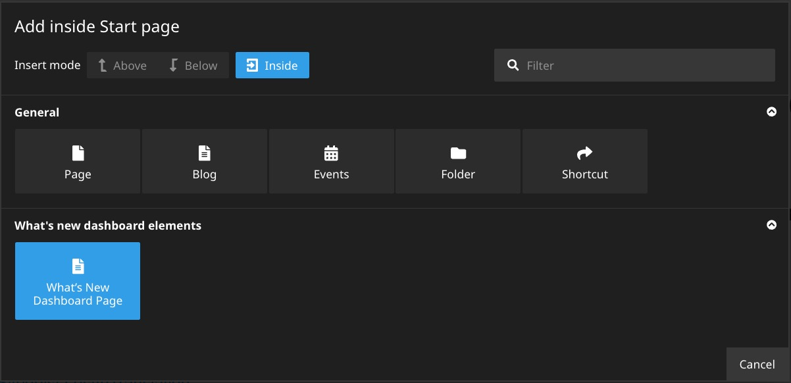
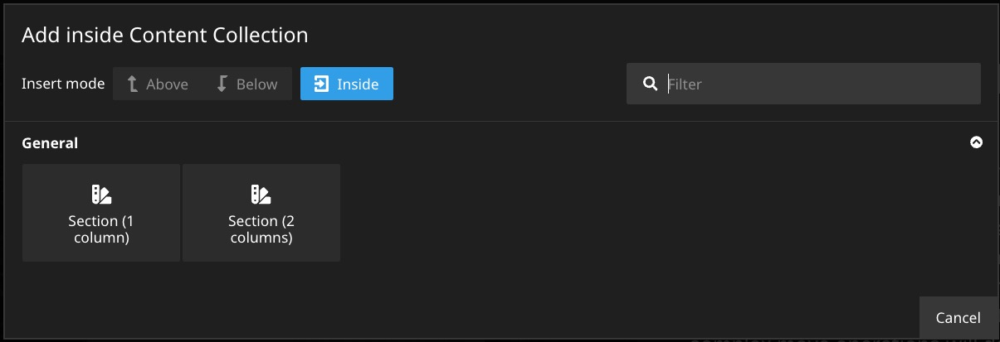
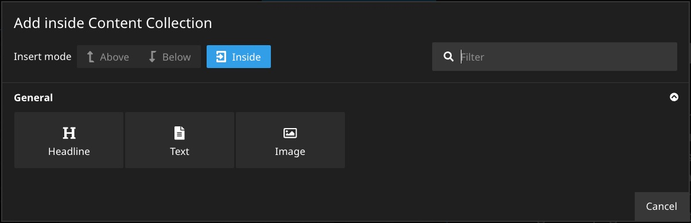

# Neos.WhatsNewEditor.InMyProject
Nodetypes for the Neos CMS for creating content which then can be shown via the corresponding [What's New Dashboard package](https://github.com/sandstorm/Neos.WhatsNewDashboard).

## Integration

### Installation

Install via composer with `composer require flowpack/neos-whatsneweditor-inmyproject`.

### Usage

Add `'Flowpack.Neos.WhatsNewEditor.InMyProject:Document.WhatsNewDashboardPage': true` to your root (or another) page > this is the entrypoint for the news. You then can find the page in the `What's new dashboard elements` section:

The url of this page will then be used for the [What's New Dashboard package](https://github.com/sandstorm/Neos.WhatsNewDashboard) to show the news for your project.

### Components

Below the main content collection you can add 2 kinds of sections. A one column section and a two column section.

In those sections you can add basic content elements to structure your project news page.

